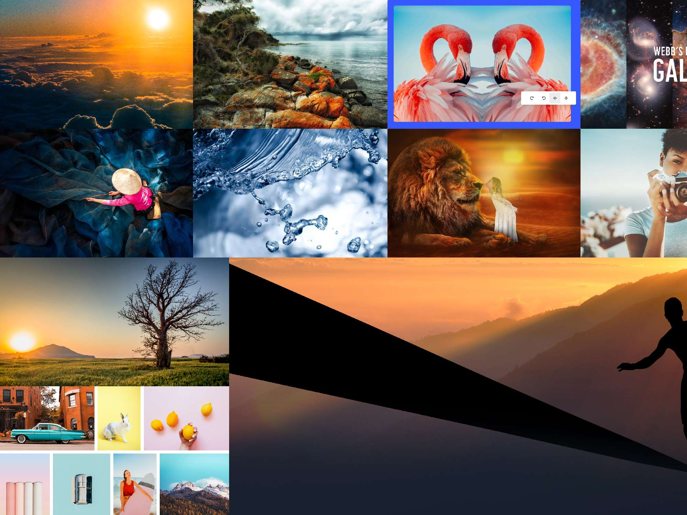
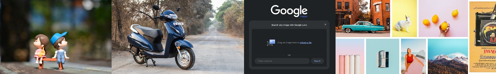
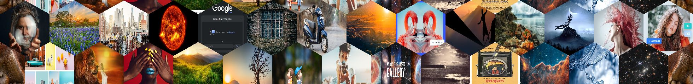
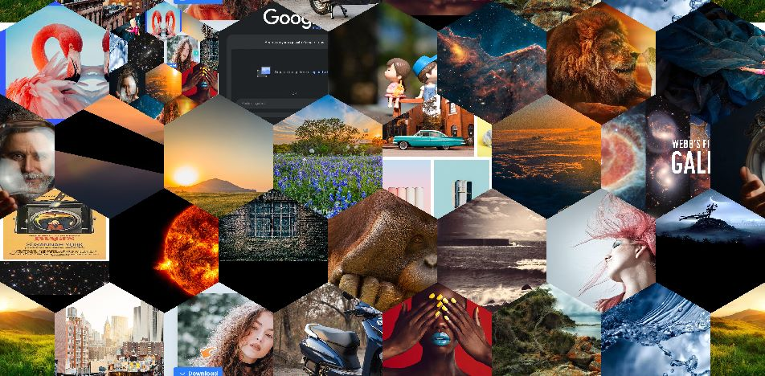

## What it does:

This JAVA Program takes multiple images from a selects folder and creates with a selectes width and height a random collage. It works with different sized images and different ratio images, so no pre-processing is necessary. Additionally, there are two available shapes to choose from: *Rectangle* and *Hexagon* 

Features:
- Only works properly on 10+ Images but made for **A LOT** of high quality images
- Perfect for posters with **100+** Images
- Can create high resolution **>100MB** png collages 
- Use original *Rectangle* shapes or *Hexagons*
- Create *Rectangles* with small and big images

 

Example results (2000x1500 rectangles):

(2000x300 rectangles)

(2000x2rows hexagon)

(2000x4rows hexagon)

## How it works:


### The variables:


| Variable       |      Example      | Description                                                              |
|:---------------|:-----------------:|:-------------------------------------------------------------------------|
| ``SHAPE``      |   ``Rectangle``   | The selected shape: Possible values are ``Rectangle`` or  ``Hexagon``    |
| ``WIDTH``      |       1000        | The width of the final image in pixel                                    |
| ``HEIGTH``     |        400        | The heigth in pixel for ``Rectangle`` and number of rows for ``Hexagon`` |
| ``IMAGE_PATH`` | /home/root/images | The complete directory path to your image directory                      |


### Run with maven and java 17:

Be sure to have maven and java 17 installed.

1. Clone repo 
```
git clone git@github.com:lr101/PictureCollage.git
```
2. Compile:
```shell
mvn install
```
3. Run the jar (or add the args in *Intellij* under **Edit Configuration**)
```shell
java -jar target/picturecollage-1.jar "<IMAGE_PATH>" "<SHAPE>" "<WIDTH>" "<HEIGHT>"  
```

### Run with Docker

Be sure to have docker installed beforehand

1. Run image from docker hub:
```shell
docker run \
  -e SHAPE="<SHAPE>" \
  -e WIDTH="<WIDTH>" \
  -e HEIGHT="<HEIGHT>" \
  -v "<IMAGE_PATH>:/images" \
  lrprojects/picture-collage:latest
```
